<!-- TOC -->
* [十亿伏特 GigaVoltage](#十亿伏特-gigavoltage)
  * [简介 Introduction](#简介-introduction)
  * [看板娘 Yuru-chara](#看板娘-yuru-chara)
  * [区别 Differences](#区别-differences)
  * [新增 New](#新增-new)
  * [详细 Details](#详细-details)
    * [存储器 Memory Bank](#存储器-memory-bank)
    * [真值表 Truth Table](#真值表-truth-table)
      * [例子 Examples](#例子-examples)
      * [规则 Rules](#规则-rules)
    * [实时钟 Real Time Clock](#实时钟-real-time-clock)
    * [声音发生器 Sound Generator](#声音发生器-sound-generator)
      * [端口定义 Input Definition](#端口定义-input-definition)
      * [音频转换 Sound Conversion](#音频转换-sound-conversion)
    * [发射器 Dispenser](#发射器-dispenser)
    * [告示牌 Sign](#告示牌-sign)
* [十亿伏特·扩展 GigaVoltage.Expand](#十亿伏特扩展-gigavoltageexpand)
  * [简介 Introduction](#简介-introduction-1)
  * [看板娘 Yuru-chara](#看板娘-yuru-chara-1)
  * [简单方块 Simple Blocks](#简单方块-simple-blocks)
  * [复杂方块 Complex Blocks](#复杂方块-complex-blocks)
    * [路选器 Multiplexer](#路选器-multiplexer)
    * [一维存储器 List Memory Bank](#一维存储器-list-memory-bank)
      * [端口定义 Input&Output Definition](#端口定义-inputoutput-definition)
      * [下端同步操作 Sync Operation by Bottom Input](#下端同步操作-sync-operation-by-bottom-input)
    * [多存储器操作器 Memory Banks Operator](#多存储器操作器-memory-banks-operator)
      * [端口定义 Input Definition](#端口定义-input-definition-1)
      * [下端同步操作 Sync Operation by Bottom Input](#下端同步操作-sync-operation-by-bottom-input-1)
    * [地形射线探测器 Terrain Raycast Detector](#地形射线探测器-terrain-raycast-detector)
    * [地形扫描仪 Terrain Scanner](#地形扫描仪-terrain-scanner)
    * [红白机模拟器 Nes Emulator](#红白机模拟器-nes-emulator)
    * [制导发射器 Guided Dispenser](#制导发射器-guided-dispenser)
    * [箱子控制器 Inventory Controller](#箱子控制器-inventory-controller)
      * [端口定义 Input Definition](#端口定义-input-definition-2)
      * [下端同步操作 Sync Operation by Bottom Input](#下端同步操作-sync-operation-by-bottom-input-2)
    * [JS单片机 Javascript Microcontroller](#js单片机-javascript-microcontroller)
  * [复数方块 Multiple Blocks](#复数方块-multiple-blocks)
    * [更多两入两出电路板 More Two In Two Out Electrics](#更多两入两出电路板-more-two-in-two-out-electrics)
    * [更多单入单出电路板 More One In One Out Electrics](#更多单入单出电路板-more-one-in-one-out-electrics)
<!-- TOC -->
# 十亿伏特 GigaVoltage
## 简介 Introduction
这是一个为生存战争游戏带来十亿伏特电力系统的mod，将原版的16个电压级别（0\~1.5V）扩展到2^32个（0\~2^32-1V）  
This is a mod for Survivalcraft that take a new Electric system with Gigavolt to the game. The original Electric system has 16 voltage level(0\~1.5V), then Gigavolt expands it to 2^32 voltage level(0\~2^32-1V).
## 看板娘 Yuru-chara

点开查看

## 区别 Differences
本Mod的方块有两个分类：
* **常规** 这个分类中的方块使用方法和效果与原版相同，即可以按照原版的16个电压级别设计电路，而且具有与原版电路分类几乎一致的排序，分类的最后是在原版其他分类中可以与电路交互的其他方块。在此分类中有两个子类：
  * **经典** 与原版使用方法和效果彻底相同的类别，会在方块名后面强调`经典`
  * **无后缀** 具有额外特性但不影响按原版的16个电压级别设计电路的方块，可以称之为`十亿伏特版`
* **变体** 这个分类中的方块最大地发挥了2^32个电压级别的特长，既然与原版不同，当然都是十亿伏特版
> `大门、栅栏门、活板门、活塞`仅有变体版而没有经典版  
> 原版可与电路交互的`木刺陷阱、圣诞树、火药桶、温度计、湿度计、家具`未提供经典版或变体版  
> 以上方块的原版可通过变压器，将十亿伏特电压转换为原版电压后再操作原版

| 方块            | 原版                            | 十亿伏特版                                                                                             |
|---------------|-------------------------------|---------------------------------------------------------------------------------------------------|
| 导线            | 7色                            | 14色                                                                                               |
| SR锁存器         | S端高压才储存                       | S端非0即储存                                                                                           |
| 开关、按钮、电池      | 默认输出1.5V                      | 默认输出0xFFFFFFFF V，其他原本默认输出1.5V的也改为默认输出此电压，不提供与原版完全一致的经典版。其中按钮可自定义输出的持续周期数。其中按钮和开关提供有色版本，不会与异色导线相连接 |
| 计数器           | 默认溢出电压为0x10V，上限为0xF V         | 默认溢出电压为0V，上限0xFFFFFFFF V，可设置溢出电压，还能直接调整当前电压                                                       |
| 真值表           | 略                             | 详见[详细-真值表](#真值表-truth-table)                                                                      |
| 存储器           | 略                             | 详见[详细-存储器](#存储器-memory-band)                                                                      |
| 实时钟           | 略                             | 详见[详细-实时钟](#实时钟-real-time-clock)                                                                  |
| 数模转换器         | 略                             | 变更为4个合并器，分别是4个1位合并成4位、4个2位合并成8位、4个4位合并成16位，4个8位合并成32位，对于要被合并的输入，会在合并前分别取它们最低的1、2、4、8位后，按顺序进行合并    |
| 模数转换器         | 略                             | 和数模转换器类似，被变更为4个拆分器，同理，输入在拆分前会被分别取最低的4、8、16、32位，再按顺序输出拆分结果                                         |
| 声音发生器         | 略                             | 详见[详细-声音发生器](#声音发生器-sound-generator)                                                              |
| 压力板           | 有压力时输出0.8\~1.5V，随意设置的压力与电压关系  | 输出准确的压力值，参考16进制结果：男性玩家0x46V，虎鲸0x5DC V                                                             |
| 活塞            | 0.8V开始伸长                      | 1V开始伸长，提高了伸长、推动或推拉、速度上限（黏住过多时卡住是游戏其他子系统问题），新增隐藏延长杆的选项，不提供与原版完全一致的经典版                              |
| 彩色LED、1面LED   | 0.8\~1.5V对应不同颜色。输入0V时显示。      | 所有电压对应不同颜色（ABGR格式）。1面LED使用独立的新发光子系统，支持半透明，可无缝拼接。输入0时不显示。                                          |
| 靶子            | 输出0.8\~1.5V                   | 输出0\~0xFFFFFF00 V，因游戏坐标精度问题，最低8位为0                                                                |
| 电子雷管          | 输入0.8v及以上电压产生威力为10的爆炸         | 输入0v以上电压产生威力等于电压的爆炸，输入0xFFFFFFFF V有彩蛋                                                             |
| 大门、栅栏门、活板门、活塞 | 收到的电压由0.7V及以下上升到0.8V及以上后开门或关门 | 根据输入的电压强度打开或部分打开，0V关门，0x2D V打开45度，0x5A V及以上完全打开；不提供与原版完全一致的经典版                                    |
| 发射器           | 略                             | 详见[详细-发射器](#发射器-dispenser)                                                                        |
| 告示牌           | 略                             | 详见[详细-告示牌](#告示牌-sign)                                                                             |
## 新增 New
| 名称       | 特性                                                                     |
|----------|------------------------------------------------------------------------|
| 总线       | 将多种颜色的导线接到亮橙色的总线上，不同颜色导线的电压能互不干扰地在总线中传输                                |
| 单向二极管    | 电压只能单向导通的二极管（有延迟），只提供彩色版本，本质上是延迟门                                      |
| 8x4面LED灯 | 和原版4面LED灯类似，但它有4x2、4x4、8x4三种布局，只提供白光。                                  |
| 8数字LED灯  | 和7段显示器类似，但它一次显示8位16进制数，只提供白光                                           |
| 变压器      | 将原版电压和十亿伏特电压互相转换的变压器，十亿伏特电压转原版电压时将取二进制最低4位输出                           |
| 调试石碑     | 提供电路运行速率调整、屏显元件电压、单步运行、超视距保持运行功能的石碑，输出当前倍速，第17\~32位为整数部分，第1\~16位为小数部分。 |
## 详细 Details
> 下面介绍的都是十亿伏特版元件
### 存储器 Memory Bank
为存储远超原版的数据量，该Mod将数据无损保存为了[PNG](https://www.w3.org/TR/png/)图片格式，因此需要先手动设置长宽，而且之后不可在编辑界面修改，长宽上限均为2^31-1，但为了避免不可预知的错误，请不要设置过于巨大的矩阵  
编辑界面用文字编辑时，每个数据用英文逗号`,`分开，每行数据用英文分号`;`分开  
当数据量较大时，不建议继续文本编辑，而建议使用图片编辑工具手动编辑导出的png文件后重新导入  
> 附失败的在线编辑器[https://xiaofengdizhu.github.io/GVMBEditor](https://xiaofengdizhu.github.io/GVMBEditor)

png要求颜色模式为24位带透明通道的RGB模式，因为游戏引擎的缘故，像素颜色会按照透明通道、蓝色、绿色、红色的顺序（即ABGR）保存进电压数据中，例如ARGB顺序的AABBCCDD像素，会被转换成AADDCCBB V的电压数据  
你不仅能够导入png文件，还能导入WAV格式的音频文件，要求为双声道，采样率8000~48000Hz之间，采样位数16位，PCM编码，检测完毕后将自动导入该文件的`data chunk`部分，例如`data chunk`开头的6个16位数据为0x0001、0x0002、0x3333、0x4567、0xBA98、0xCDEF，写入存储器的数据将是：0x00010002、0x33334567、0xBA98CDEF；当导入非png和wav的普通文件时，将从开头直接32位32位地读取并写入存储器中  
各输入端均未连接元件或导线时，上端将输出该真值表的ID
### 真值表 Truth Table
表征逻辑事件输入和输出之间全部可能状态的表格
#### 例子 Examples
此套规则的计算表达式基于[NCalc2](https://github.com/sklose/NCalc2)，写法类似于Excel公式，请先看具体例子：  
* `1;2;3;4:5`输入1\~4分别为1、2、3、4V时，输出5V  
* `>0x1;<=0xA;i3>1&&i3<99:0xABC`输入1大于1V，输入2小于等于十六进制A V，输入3同时满足大于1V和小于99V，输出4为任意值时，输出十六进制ABC V  
* `0;0;0;0;;i2;true;>i1:10`输入变化前输入1~4均为0V；变化后输入1等于输入2，输入2为任意值（也可以写i1，但没必要，不过因为还要设定输入3的规则，所以此处需填true），输入3大于输入1，输入4为任意值，输出10V（使用两个英文引号`;;`分开输入变化前的规则和变化后的规则，最多可以获取15次输入变化前的规则）  
* `0;;1;;2;;3:4::5:6::7:8`现在输入1为3V，输入变化前输入1为2V，再上一次输入变化前输入1为1V，再上一次输入变化前输入为0V，则现在输出4V；如果前一组规则未满足，则继续计算下一组规则`5:6` ，未满足则再计算下一组规则`7:8`（使用两个英文冒号`::`分开多套输入输出规则）  
* `true;true;Min(i1,i2),Max(i1,i2):i1+i2`输入1、2为任意值，输入3是输入1、输入2中的较小值，输入4是输入1、输入2中的较大值，则输出输入1+输入2  
#### 规则 Rules
* 4个输入规则之间用英文分号`;`分隔，如果只给输入1、2设定规则，输入3、4的规则可以不写，但也请不要加上多余的`;`；不能只给输入1、3设定规则，至少要给第2输入设定规则`true`  
* 如果输入规则的开头是`=`、`!=`、`>`、`<`，此Mod会根据是第几个输入，自动在开头加上`i1`、`i2`……  
* 如果输入规则不是`true`，且不包含`=`、`!`、`not`、`>`、`<`、`and`、`&&`、`||`、`or`中的任意一个操作符，此Mod会自动在开头加上`i1=`、`i2=`……  
* 使用两个英文分号`;;`来分隔时序，越左边时序越早，最右边的时序是现在的输入，最多取得15次变化前的输入  
* 只有输入规则的计算结果是`true`时，才会计算下一个输入规则，然后计算下一组时序，直到所有规则计算结果均为`true`，才会计算此组规则设定的输出  
* 使用英文冒号`:`来分隔所有输入规则和输出规则，输出规则的计算结果必须为自然数（>=0的整数）  
* 使用两个英文冒号`::`来分隔多套输入输出规则，当第一套规则不输出时，则计算下一套规则，直到有输出为止，最多2^32-1套  
* 过程中出现任何错误均会直接停止计算并输出0，错误详见游戏日志
* 数字默认为十进制，如要使用十六进制数字，请在十六进制数字前加上`0x`，二进制则在其前面加上`0b`，非十进制时不支持小数点
> **注意**：规则对大小写敏感！

如果想了解更多，请参见以下链接：
* [操作符](https://github.com/ncalc/ncalc/wiki/Operators) `= > < + - * /`等
* [函数](https://github.com/ncalc/ncalc/wiki/Functions) `if Max Sin`等  
其中三角函数的输入应该是弧度，并额外提供`Atan2 Cosh Sinh Tanh`，此类函数计算过程中将把数字转换为双精度浮点数进行计算，过程中保留小数，输出电压时会自动去除小数部分；其中`Round`使用两个参数会得出奇怪结果未能解决
* [值](https://github.com/ncalc/ncalc/wiki/Values) `9876 1.23e9 true false`等  
额外提供`PI() E()`来获取圆周率π、自然常数e
### 实时钟 Real Time Clock
与原版（经典）实时钟类似，但输出的是现实世界的时间（从运行设备获取），而且背端是输入，背端不同输入，正面四个端口将有不同的输出

| 背端输入  | 端口1                | 端口2                  | 端口3       | 端口4 |
|-------|--------------------|----------------------|-----------|-----|
| 0V或其他 | 毫秒                 | 秒                    | 分         | 时   |
| 1V    | 星期                 | 日                    | 月         | 年   |
| 2V    | 计时周期的低32位          | 计时周期的高32位            | 0V        | 0V  |
| 3V    | 距离开始降水的时间，或已经降水的时间 | 降水时输出FFFFFFFF V，否则0V | 距离结束降水的时间 | 0V  |
> 计时周期：公历中自公历0001年1月1日午夜00:00:00.000以来经过的以100纳秒为间隔的数目，不包括归因于闰秒的嘀嗒数
### 声音发生器 Sound Generator
可以从存储器加载WAV格式音频数据并播放的声音发生器  
#### 端口定义 Input Definition
| 端口 | 作用     | 说明                                                                               |
|----|--------|----------------------------------------------------------------------------------|
| 后端 | 存储器ID  | 下端为0V，此端电压发生变化时，从指定ID的存储器读取音频数据                                                  |
| 左端 | 采样率    | 范围限制：8000\~48000，对应十六进制：1F40\~BB80                                               |
| 上端 | 播放开始位置 | 设置从第n个16位数据开始播放，仅在读取音频数据时发生作用；例如左端设为44100V，此端设为88200V，那么将从88200V/2/44100=1秒处开始播放 |
| 右端 | 播放数量   | 设置播放n个16位数据，仅在读取音频数据时发生作用                                                        |
| 下端 | 响度     | 电压从0V上升后立即开始播放，设为0V停止，再上升后从头播放，电压越高响度越大；0V时如果其他四端输入发生变化，将尝试重新从指定存储器读取音频数据        |
#### 音频转换 Sound Conversion
要使用声音发生器，首先需要使用[ffmpeg](https://ffmpeg.org/)或[格式工厂](http://www.pcgeshi.com/index.html)等软件将音频转换为双声道，采样率8000~48000Hz之间，采样位数16位，PCM编码的WAV格式音频，再使用存储器的导入功能导入该文件
### 发射器 Dispenser
可以通过输入的电压来控制射出的速度、角度等，一旦电压变化就会尝试发射

| 开始位数 | 使用位数 | 说明                                                                 |
|------|------|--------------------------------------------------------------------|
| 1    | 8    | 速度：单位格/秒，最大设置255格/秒                                                |
| 9    | 8    | 角度1：面向上方或下方时，为向北方偏转的角度；面向其他方向时，为向右边偏转的角度；最高位为1时角度取负值；超过90时自动下调为90度 |
| 17   | 8    | 角度2：面向上方或下方时，为向西方偏转的角度；面向其他方向时，为向上方偏转的角度；最高位为1时角度取负值；超过90时自动下调为90度 |
| 25   | 1    | 为1时不受重力影响                                                          |
| 26   | 1    | 为1时不受空气等阻力影响                                                       |
| 27   | 1    | 为1时启用安全模式，不会触发投射物被发射时、撞到方块时的行为，仍然会触发被撞击方块的相关行为                     |
| 28   | 1    | 为1时与非空气、流体相撞时，投射物将自身放置到世界中（如果可以的话）                                 |
| 29   | 1    | 为1时可设置只发射指定槽位的方块                                                   |
| 30   | 3    | 指定槽位：指定只发射第n+1个槽位的方块                                               |
### 告示牌 Sign
不仅具有原版的显示文字、弹出提示功能，还可以额外悬浮显示文字，通过不同端口控制悬浮显示的内容、大小、位置、旋转、亮度、颜色，但只能记录一行文字，具体端口定义如下（从左到右为高位到低位）
<table>
    <thead align="center">
        <tr>
            <th>端口</th>
            <th colspan="4">作用</th>
        </tr>
    </thead>
    <tbody align="center">
        <tr>
            <td rowspan=2>后端</td>
            <td colspan="4">32位 要读取的存储板ID</td>
        </tr>
        <tr>
            <td colspan="4">将以UTF8编码读取指定ID的存储板中的数据并立即写入到告示牌中，同时影响告示牌上直接显示的文字</td>
        </tr>
        <tr>
            <td rowspan="2">上端</td>
            <td colspan="2">16位 Y轴位置偏移</td>
            <td colspan="2">16位 缩放大小</td>
        </tr>
        <tr>
            <td colspan="2">每加1，显示向上移动1/8格，最高位为1时向下，即移动范围为±4096格</td>
            <td colspan="2">每加1，显示大小增加1/8倍，最大8192倍</td>
        </tr>
        <tr>
            <td rowspan="2">右端</td>
            <td colspan="2">16位 Z轴位置偏移</td>
            <td colspan="2">16位 X轴位置偏移</td>
        </tr>
        <tr>
            <td colspan="2">每加1，显示向西移动1/8格，最高位为1时向东</td>
            <td colspan="2">每加1，显示向北移动1/8格，最高位为1时向南</td>
        </tr>
        <tr>
            <td rowspan="2">下端</td>
            <td>4位 亮度</td>
            <td>1位 弹出提示</td>
            <td>3位 旋转的符号</td>
            <td>24位 旋转</td>
        </tr>
        <tr>
            <td>值越大越亮，越小越暗</td>
            <td>从0变为1时弹出提示</td>
            <td>从高到低的3位分别控制偏航角、俯仰角、翻滚角的正负，为1时取负（非补码，仅是简单加负号，其他取负同理）</td>
            <td>从高到低，每8位分别控制方块的偏航角（Yaw）、俯仰角（Pitch）、翻滚角（Roll），单位为角度</td>
        </tr>
        <tr>
            <td rowspan=2>左端</td>
            <td colspan="4">32位 颜色</td>
        </tr>
        <tr>
            <td colspan="4">控制显示的颜色，ABGR格式</td>
        </tr>
    </tbody>
</table>

# 十亿伏特·扩展 GigaVoltage.Expand
## 简介 Introduction
这是一个为生存战争游戏十亿伏特mod带来更多电路板和功能的mod，具有两个分类：  
This is a mod for Survivalcraft Gigavolt mod that take more circuit components and functions to the mod. Two categories:
* **扩展** 单种方块占用背包格数较少的，会放在此分类 
* **复数** 单种方块占用背包格数特别多的，会放在此分类
## 看板娘 Yuru-chara

点开查看

## 简单方块 Simple Blocks
| 名称         | 特性                                                                                                                                                                                                                                                                                                                               |
|------------|----------------------------------------------------------------------------------------------------------------------------------------------------------------------------------------------------------------------------------------------------------------------------------------------------------------------------------|
| 铜锤         | 有两种使用方法： 1. 转换导线和穿线块：对着导线使用，会将一格范围内的所有导线转换为穿线块，已摆放导线的面将互相连通，未摆放导线的面不互通；多次对生成的穿线块使用将改变其外观，第5次恢复为普通导线；穿线块可染色，仅影响外观，不影响接线 2. 快速铺设穿线块：对着非导线方块使用以设定起点，在另一个位置使用以设定终点，此时将出现提示框，最后对着终点再次使用，将自动在两点间铺设穿线块；可通过编辑铜锤来改变使用的穿线块材质                                                                                                       |
| 六面跨线块      | 相对的两面互相导通；可染色，仅影响外观，不影响接线                                                                                                                                                                                                                                                                                                        |
| 跳线         | 背端-标签，下端-输入，上端-输出，左端-是否从下端输入，右端-是否从其他跳线输入，具体：背端输入大于0V的电压时，将与其他背面输入一样电压（即标签相同）的跳线相连接；当左端输入电压大于7V时，会将下端输入的电压输出到标签相同的其他跳线；当右端输入电压大于7V时，将会从标签相同的其他跳线获取其下端输入的电压，如果其他跳线的左端输入小于7V，则获取不到这个跳线的下端电压；最后，从下端和标签相同的其他跳线获取的电压在进行或运算后从上端输出。标签相同的跳线间将形成一条绿色的指示线                                                                                  |
| 方块值板       | 其上有方块时，会输出等于最后一块放上的方块值的电信号，一旦所有方块离开，输出立即变为0V                                                                                                                                                                                                                                                                                     |
| 易失性存储器     | 和存储器相似，但退出游戏后数据会丢失，不过ID保持不变，无需初始化即可使用                                                                                                                                                                                                                                                                                            |
| 简单方块展示板    | 输入等于等于要显示的方块值的电压，就会在其面前显示方块                                                                                                                                                                                                                                                                                                      |
| 复杂方块展示板    | 接口定义与告示牌几乎相同，存在以下区别：背端应输入等于要显示的方块值的电压；下端第28、30\~32位无作用；下端第29位为1时保留让之前显示的方块，使其持续显示，一旦为0将清空之前显示的方块，退出存档也清空                                                                                                                                                                                                                         |
| 简单图片显示器    | 输入等于存储了图形数据的存储板ID的电压，就会在其面前显示图片                                                                                                                                                                                                                                                                                                  |
| 复杂图片显示器    | 接口定义与告示牌几乎相同，存在以下区别：背端应输入等于存储了地层数据的存储板ID的电压；下端第30\~32位无作用；下端第28位用于指定图片的缩放方式，为0时将以各向异性过滤方式缩放，为1时将以保留硬边缘方式缩放；下端第29位为1时保留让之前显示的图片，使其持续显示，一旦为0将清空之前显示的图片，退出存档也清空                                                                                                                                                                     |
| 简单地层显示器    | 输入等于存储了地层数据的存储板ID的电压，就会在其面前显示地层（CPU占用高，请勿显示过大的地层）                                                                                                                                                                                                                                                                                |
| 复杂地层显示器    | 接口定义与告示牌几乎相同，存在以下区别：背端应输入等于存储了地层数据的存储板ID的电压；下端第30\~32位无作用；下端第28位用于指定方块材质的缩放方式，为0时将以各向异性过滤方式缩放，为1时将以保留硬边缘方式缩放；下端第29位为1时保留让之前显示的地层，使其持续显示，一旦为0将清空之前显示的地层，退出存档也清空                                                                                                                                                                   |
| 破坏球        | 破坏投掷出后碰到的方块（必须碰到）。使用GV发射器来发射，并启用不受重力影响或不受空气等阻力影响时，它可破坏非完整一格的方块（仍需碰到）。使用GV制导发射器来发射，顺利抵达指定位置时，即使没碰到方块，也会破坏指定位置的方块                                                                                                                                                                                                                  |
| 交互球        | 与破坏球相似，但效果是产生交互                                                                                                                                                                                                                                                                                                                  |
| 特殊值修改球     | 与破坏球相似，但效果是修改目标方块的特殊值为自身的特殊值，同时你可以编辑它的特殊值                                                                                                                                                                                                                                                                                        |
| 箱子提取器-指定槽位 | 用于从箱子、熔炉、发射器等可存储物品的方块中提取物品。提取器的形状是T字形，横线的一端摆放要取出物品的箱子，另一端如不摆放箱子，提取器将尝试把物品丢出；如摆放箱子，则向其存入提取的物品；也可以摆放延长杆，可以无延迟地远距离传送物品，另外延长杆是双向的。如果在两个箱子间摆放两个相对的提取器，那么这两个箱子将能够双向传送物品。需要使用电路来控制提取器，每次电压变化都将尝试进行提取，如果有多个输入，会将它们进行或运算。 对于指定槽位版提取器，输入电压最低8位用于指定要提取的槽位，接下来较高的8位用于指定数量，再接下来1位（第17位）如果为1，则忽略指定的数量，直接提取该槽位全部的物品；再接下来1位（第18位）如果为1，则阻止丢出 |
| 箱子提取器-指定ID | 和指定槽位版本不同之处在于：输入电压最低10位用于指定要提取的方块ID；接下来较高的1位如果为1，则同时判断方块特殊值；接下来较高的1位（第11位）如果为1，则同时判断方块特殊值；第12位如果为1，则提取全部符合条件的物品，否则提取1个；第13位如果为1，则阻止丢出；第14位无作用；接下来剩余18位用于设置判断用的方块特殊值                                                                                                                                                              |
| 箱子提取延长杆    | 用于让提取器能够无延迟地远距离传送物品，而且是双向的                                                                                                                                                                                                                                                                                                       |
| 遥控器        | 远程操作和遥控器同色的开关、按钮                                                                                                                                                                                                                                                                                                                 |
## 复杂方块 Complex Blocks
### 路选器 Multiplexer
可以通过背面控制正面四个端点的导通和断开，内部设计如下图  

* 圆圈代表电压节点，ABCD四个节点能从正面1234四个端点输入和输出电压，abcdO是辅助节点
* 虚线代表常断的电压通路，共10条；实线代表常通的电压通路，共8条
* 每条通路由两根单向导线组成，每根导线上都有一个开关，共28个开关
* 可以通过背面电压控制这28个开关：
  * 对于常断通路，例如最低1位为1时，图中1号开关闭合，导线导通，电压能从A传导到a；第2低的位为1时，图中2号开关闭合，导线导通，电压能从a传导到A，以此类推
  * 对于常通通路，例如第26位为1时，电压将不能直接从O传导到c
* 节点接收到新的电压时，会与此电压进行或运算，得到新的电压，例如节点c原本的电压是5V，从节点O收到3V，节点c的电压将会变成5|3=7V
* 节点电压发生变化后，将向能传导到的其他节点传导新的电压，直到所有节点电压稳定，最后从ABCD节点向正面1234端点输出结果
* 每次背面和正面输入的电压发生变化时，内部节点都将复位归0，重新计算输出结果
> 例子：背面输入16进制的21V（二进制100001），开关1、6将闭合，此时在正面1端点输入5V，该电压将从A节点流入，延导线1传导到a，延21传导到O，延26传导到c，延6传导到C，最终从正面3号端点输出5V
### 一维存储器 List Memory Bank
和存储器相似，但只能存储一行数据，不过多了很多实用功能，无需初始化即可使用，保存到存档的形式是二进制文件，可用十六进制编辑器编辑。同时提供了易失版（即退出游戏后数据会丢失，不过ID保持不变）
> 导出功能将导出指定宽高的图片
#### 端口定义 Input&Output Definition
| 端口 | 作用    |
|----|-------|
| 上端 | 输出数据  |
| 左端 | 左索引输入 |
| 右端 | 右索引输入 |
| 后端 | 输入数据  |
| 下端 | 同步操作  |
> 注意：索引从0开始
#### 下端同步操作 Sync Operation by Bottom Input
| 电压               | 操作       | 说明                                                                                                                                                                                                |
|------------------|----------|---------------------------------------------------------------------------------------------------------------------------------------------------------------------------------------------------|
| 无                | 异步读      | 下端无输入时，上端实时输出右索引位置的数据（超出范围时输出0，下同）                                                                                                                                                                |
| 0或未指定            | 无        | 下端输入0或以下未指定的电压时所有输出均输出0，且一旦下端有输入电压（含0V），该电路板将进入同步工作模式，该端输入变化时才会进行操作，输出不会随其他输入电压改变而立即发生改变                                                                                                          |
| 1                | 读取       | 读取右索引位置的数据输出到上端                                                                                                                                                                                   |
| 2                | 写入       | 将后端输入数据覆写到左右索引范围内（含两个索引位置，左索引为0时只覆写到右索引，下同）                                                                                                                                                       |
| 3                | 插入       | 将后端输入数据插入到左右索引范围内（在较小的索引位置插入较大索引减较小索引再加一的数量的后端输入数据）                                                                                                                                               |
| 4                | 剪切       | 读取右索引位置的数据输出到上端后删除                                                                                                                                                                                |
| 5                | 删除       | 将左右索引范围内数据删除                                                                                                                                                                                      |
| 6                | 顺查       | 从左右索引中较小的索引开始，按顺序查找后端输入数据，最多查找到较大的索引，最后将找到的索引位置输出到上端（未找到则输出0xFFFFFFFF；左右索引均为0时从头找到尾）                                                                                                              |
| 7                | 倒查       | 从左右索引中较大的索引开始，按倒序查找后端输入数据，最少查找到较小的索引，最后将找到的索引位置输出到上端（未找到则输出0xFFFFFFFF；左右索引均为0时从尾找到头）                                                                                                              |
| 8                | 查删       | 将左右索引范围内等于后端输入数据的数据删除，上端输出删除的数据个数                                                                                                                                                                 |
| 9                | 查询数量     | 将左右索引范围内等于后端输入数据的数据数量输出到上端                                                                                                                                                                        |
| 10(0xA)          | 复制粘贴     | 将右索引的数据复制粘贴到左索引位置(右索引位置数据为0时将粘贴0，下同)                                                                                                                                                              |
| 11(0xB)          | 复制插入     | 将右索引的数据复制插入到左索引位置                                                                                                                                                                                 |                                                                                              |
| 12(0xC)          | 反转       | 将左右索引范围内数据顺序反转                                                                                                                                                                                    |
| 13(0xD)          | 升序       | 将左右索引范围内数据从小到大重新排列                                                                                                                                                                                |
| 14(0xE)          | 降序       | 将左右索引范围内数据从大到小重新排列                                                                                                                                                                                |
| 15(0xF)          | 数据数量     | 在上端输出当前存储的数据数量（提示：设置过大索引的数据会导致结果膨胀）                                                                                                                                                               |
| 16\~31(0x10\~1F) | 左批量二元计算器 | 对左右索引范围内所有数据分别进行二元数学运算，原本的数据作为运算的左值，后端输入数据作为运算的右值，下端输入从小到大对应的运算方式分别为加法、减法、乘法、除法、取余、等于、大于、大于等于、小于、小于等于、取大、取小、左移、右移、乘方、对数（左真右底）                                                                     |
| 32\~47(0x20\~2F) | 右批量二元计算器 | 和左批量计算器相似，只是原本的数据作为运算的右值，后端输入数据作为运算的左值                                                                                                                                                            |
| 48\~66(0x30\~42) | 批量一元计算器  | 对左右索引范围内所有数据分别进行一元数学运算，原本的数据作为运算的输入，下端从小到大对应的运算方式分别为正弦、余弦、正切、余切、正割、余割、反正弦、反余弦、反正切、双曲正弦、双曲余弦、双曲正切、角度转弧度、弧度转角度、原码正负转换、补码正负转换、取反、加一、减一；输入和输出最高位为1时代表负数，第17\~31位为整数部分，第1\~16位为小数部分，默认为弧度制，负数表示默认为原码模式 |
| 256(0x100)       | 设置宽      | 设置被图片、地层显示器读取时显示的宽度，默认为0                                                                                                                                                                          |
| 257(0x101)       | 设置高      | 设置被图片、地层显示器读取时显示的高度，默认为0                                                                                                                                                                          |
| 258(0x102)       | 设置初始偏移   | 设置被图片、地层显示器读取时开头多少个数据不被读取，默认为0                                                                                                                                                                    |
| 272(0x110)       | 获取宽      | 获取设置的宽                                                                                                                                                                                            |
| 273(0x111)       | 获取高      | 获取设置的高                                                                                                                                                                                            |
| 274(0x112)       | 获取初始偏移   | 获取设置的初始偏移                                                                                                                                                                                         |
### 多存储器操作器 Memory Banks Operator
左右两边各指定一个存储板ID，按下端输入进行不同操作后，将结果输出到由上端输入指定ID的存储板  
上左右都应该指定正确的存储板ID，只有在下端为1时允许右端指定ID的存储板不存在，否则将不进行任何操作  
复制时，如果被复制存储器是一维存储器或易失性一维存储器，则会给输出存储板设置与其一样的宽度，但高度会按照一维存储器内的数据量计算并设置；否则设置与被复制存储器相同的宽高  
复制以外的操作，输出存储板的高度将被设置为1，宽度被设置为数据总数量，因此推荐输出到可设置宽高的一维存储器
#### 端口定义 Input Definition
| 端口 | 作用             |
|----|----------------|
| 上端 | 将结果输出到指定ID的存储板 |
| 左端 | 指定左存储板ID       |
| 右端 | 指定右存储板ID       |
| 后端 | 同步操作的参数        |
| 下端 | 同步操作           |
#### 下端同步操作 Sync Operation by Bottom Input
| 电压    | 操作     | 说明                                                          |
|-------|--------|-------------------------------------------------------------|
| 0或未指定 | 无      | 当下端输入变化时才会进行操作，不会因其他端口输入电压改变而立即执行操作                         |
| 1     | 合并/复制  | 左右两边所有数据直接合并，左边数据在前，右边数据在后；如果右端指定ID的存储板不存在，而左边存在，则相当于复制左边数据 |
| 2     | 插入     | 将右边所有数据插入到左边数据，可使用后端输入指定插入的位置；如果指定位置大于左边数据的数量，则会在中间补0       |
| 3     | 覆盖     | 将右边所有数据覆盖到左边数据，可使用后端输入指定覆盖开始的位置；如果指定位置大于左边数据的数量，则会在中间补0     |
| 4     | 交集     | 将左边数据逐一与右边所有数据比对，如果右边也存在则保留，否则删除                            |
| 5     | 交集（去重） | 同上，但最后还会对结果进行去重                                             |
| 6     | 差集     | 将左边数据逐一与右边所有数据比对，如果右边存在则删除，否则保留                             |
| 7     | 差集（去重） | 同上，但最后还会对结果进行去重                                             |
### 地形射线探测器 Terrain Raycast Detector
每次输入变化后，向探测器面对的方向逐格探测是否存在非空气方块，并返回方块值、距离、连续多少个相同方块，需要先设置探测距离；还具有探测指定方块等功能，详见下表
<table>
    <thead align="center">
        <tr>
            <th colspan="2">端口</th>
            <th colspan="4">作用</th>
        </tr>
    </thead>
    <tbody align="center">
        <tr>
            <td rowspan="4">输入</td>
            <td rowspan=2>左端</td>
            <td colspan="2">18位 检测指定方块特殊值</td>
            <td>4位 空</td>
            <td>10位 检测指定方块ID</td>
        </tr>
        <tr>
            <td colspan="2">如果“是否同时检测方块特殊值”位为1，则探测方块时同时检测方块特殊值是否与该部分相等</td>
            <td>无作用</td>
            <td>如果该部分大于0，将探测方块ID与该部分相等的方块</td>
        </tr>
        <tr>
            <td rowspan="2">右端</td>
            <td>8位 空</td>
            <td>1位 是否跳过液体</td>
            <td>1位 是否同时检测方块特殊值</td>
            <td>12位 探测距离</td>
        </tr>
        <tr>
            <td>无作用</td>
            <td>如果为1，探测时将跳过水和岩浆方块，该设置优先级高于检测指定方块ID</td>
            <td>详见“检测指定方块特殊值”的说明</td>
            <td>最多探测多少格</td>
        </tr>
        <tr>
            <td rowspan="6">输出</td>
            <td rowspan="2">上端</td>
            <td colspan="4">32位 方块值</td>
        </tr>
        <tr>
            <td colspan="4">探测到最近的符合条件的方块的值（最低的10位为方块ID，15位及之后为方块特殊值）</td>
        </tr>
        <tr>
            <td rowspan="2">下端</td>
            <td  colspan="4">32位 距离</td>
        </tr>
        <tr>
            <td  colspan="4">探测到最近的符合条件的方块的距离，单位格</td>
        </tr>
        <tr>
            <td rowspan=4>后端</td>
            <td colspan="4">32位 连续方块数量</td>
        </tr>
        <tr>
            <td colspan="4">探测到符合条件的方块后，输出当前方向连续出现了多少个该方块</td>
        </tr>
    </tbody>
</table>

### 地形扫描仪 Terrain Scanner
向扫描仪面对的面平行扫描方块，将结果保存到指定存储器，可指定起始距离和范围
<table>
    <thead align="center">
        <tr>
            <th colspan="">端口</th>
            <th colspan="4">作用</th>
        </tr>
    </thead>
    <tbody align="center">
        <tr>
            <td rowspan=2>上端</td>
            <td>15位 空</td>
            <td>1位 是否存储方块特殊值</td>
            <td>16位 起始距离</td>
        </tr>
        <tr>
            <td>无作用</td>
            <td>为0时只保存方块ID，为1时方块ID和数据一并保存</td>
            <td>每加1，扫描起始位置距离扫描仪面向的方向加1格，最高位为1时向背面</td>
        </tr>
        <tr>
            <td rowspan="2">右端</td>
            <td colspan="2">16位 起始横向偏移</td>
            <td>16位 起始纵向偏移</td>
        </tr>
        <tr>
            <td colspan="2">每加1，扫描起始位置横向偏移1格，最高位为1时取反方向，正方向的定义另见下表</td>
            <td>每加1，扫描起始位置纵向偏移1格，最高位为1时取反方向，正方向的定义另见下表</td>
        </tr>
        <tr>
            <td rowspan="2">左端</td>
            <td colspan="2">16位 横向扫描宽度</td>
            <td>16位 纵向扫描高度</td>
        </tr>
        <tr>
            <td colspan="2">每加1，扫描的宽度加1格，扫描方向的定义另见下表</td>
            <td>每加1，扫描的高度加1格，扫描方向的定义另见下表</td>
        </tr>
        <tr>
            <td rowspan="2">后端</td>
            <td colspan="3">32位 存储器ID</td>
        </tr>
        <tr>
            <td colspan="3">指定要保存到的存储器的ID</td>
        </tr>
        <tr>
            <td rowspan="2">下端</td>
            <td colspan="3">32位 启动</td>
        </tr>
        <tr>
            <td colspan="3">从0变为非0时启动扫描并将结果保存到指定ID的存储器</td>
        </tr>
    </tbody>
</table>

> **注意** 扫描成功将直接覆盖存储器原始数据！

| 扫描仪面对方向 | 起始横向偏移正方向 | 起始纵向偏移正方向 | 横向扫描方向  | 纵向扫描方向  |
|---------|-----------|-----------|---------|---------|
| Y轴-上或下  | X轴正方向-北   | Z轴正方向-西   | X轴正方向-北 | Z轴正方向-西 |
| X轴-北或南  | Z轴正方向-西   | Y轴正方向-上   | Z轴正方向-西 | Y轴负方向-下 |
| Z轴-东或西  | X轴正方向-北   | Y轴正方向-上   | X轴正方向-北 | Y轴负方向-下 |

### 红白机模拟器 Nes Emulator
可以模拟红白机的模拟器，使用的库是[XamariNES](https://github.com/enusbaum/XamariNES)，纯软件模拟（CPU运算），不支持声音输出，仅支持CNROM、MMC1、NROM、UxROM四种ROM格式的游戏，可能能够支持的游戏有超级玛丽、双截龙、恶魔城、冒险岛、勇者斗恶龙、合金装备、魂斗罗  
整个游戏同时仅运行一个模拟器实例，多个红白机模拟器方块显示的内容是一样的，输入的手柄操作会按或计算后传输给模拟器，因此可以同屏异地联机  
游戏运行时会自动加载XamariNES内置测试ROM，如果要载入其他ROM，请编辑该方块，输入ROM的路径，或存储器的ID，点击确定，会立即从指定路径、存储器读取ROM，输入`nestest`则载入XamariNES内置测试ROM
方块的各面输入会按或计算后执行，电压各位从低到高作用如下：

| 位      | 作用  | 说明                           |
|--------|-----|------------------------------|
| 1      | 电源  | 0为关闭，1为开启                    |
| 2      | 重置  | 0为不重置，1为执行重置；如一直为1，会不停重置     |
| 3\~4   | 旋转  | 0为正位，1为顺时针旋转90度，2、3同理        |
| 5\~8   | 空   | 无作用                          |
| 9\~16  | 手柄1 | 从高位到低位分别对应：→←↓↑StartSelectBA |
| 17\~24 | 手柄2 | 尚未支持                         |
| 25\~31 | 缩放  | 0、1为1个方块大，2为2个方块大，最大128方块大   |
| 32     | 空   | 无作用                          |
### 制导发射器 Guided Dispenser
和发射器类似，但不是指定速度和角度，而是直接指定要投射到的位置（不保证100%抵达），而且能设置抵达指定位置时是否将投射物放置到世界中，投射物不受空气阻力影响，受重力影响

| 位数     | 说明                                                                                             |
|--------|------------------------------------------------------------------------------------------------|
| 1\~8   | X轴位置偏移：每加1，要投射到的位置向北偏移1格                                                                       |
| 9\~16  | Y轴位置偏移：每加1，要投射到的位置向上偏移1格                                                                       |
| 17\~24 | Z轴位置偏移：每加1，要投射到的位置向西偏移1格                                                                       |
| 25     | X轴位置偏移的符号：为1时，向北改为向南                                                                           |
| 26     | Y轴位置偏移的符号：为1时，向上改为向下                                                                           |
| 27     | Z轴位置偏移的符号：为1时，向西改为向东                                                                           |
| 28     | 为1时与非空气、流体相撞时，或抵达指定的偏移位置时，投射物将自身放置到世界中（如果可以的话）；会自动开启安全模式（不会触发投射物被发射时、撞到方块时的行为，仍然会触发被撞击方块的相关行为） |
| 29     | 为1时可设置只发射指定槽位的方块                                                                               |
| 30\~32 | 指定槽位：指定只发射第n+1个槽位的方块                                                                           |
### 箱子控制器 Inventory Controller
用于控制箱子、熔炉、发射器等可存储物品的方块中的物品，也可以控制生存模式玩家背包中的物品
#### 端口定义 Input Definition
<table>
    <thead align="center">
        <tr>
            <th colspan="">端口</th>
            <th colspan="7">作用</th>
        </tr>
    </thead>
    <tbody align="center">
        <tr>
            <td rowspan=2>上端</td>
            <td colspan="7">32位 输出结果</td>
        </tr>
        <tr>
            <td colspan="7">因为结果经常为0，所以默认输出0xFFFFFFFF V，出错时也输出此结果</td>
        </tr>
        <tr>
            <td rowspan=2>左端</td>
            <td colspan="3">18位 指定要控制的物品方块特殊值</td>
            <td>4位 空</td>
            <td colspan="3">10位 指定要控制的物品方块ID</td>
        </tr>
        <tr>
            <td colspan="3">如果“是否判断方块特殊值”位为1，则判断物品方块ID时还会判断其方块特殊值是否与该部分相等</td>
            <td>无作用</td>
            <td colspan="3">如果该部分大于0，将判断物品方块ID是否与该部分相等</td>
        </tr>
        <tr>
            <td rowspan="2">右端</td>
            <td>8位 新指定槽位</td>
            <td>5位 指定玩家序号</td>
            <td>1位 是否控制玩家背包</td>
            <td>1位 是否全部数量</td>
            <td>1位 是否判断方块特殊值</td>
            <td>8位 指定数量</td>
            <td>8位 指定槽位</td>
        </tr>
        <tr>
            <td>仅用于下端电压为16V时的移动到的目标槽位</td>
            <td>当控制玩家背包时，指定要控制第几个玩家的背包</td>
            <td>为0时控制该电路板<b>背部的</b>箱子、熔炉、发射器，为1时改为控制<b>生存模式</b>玩家的背包</td>
            <td>为1时忽略“指定数量”，改为尽可能控制所有符合条件的物品</td>
            <td>详见“指定要控制的物品方块特殊值”</td>
            <td>指定要被控制的物品数量</td>
            <td>指定要被控制的槽位</td>
        </tr>
        <tr>
            <td rowspan="2">后端</td>
            <td colspan="7">32位 空</td>
        </tr>
        <tr>
            <td colspan="7">无作用</td>
        </tr>
        <tr>
            <td rowspan="2">下端</td>
            <td colspan="7">32位 同步操作</td>
        </tr>
        <tr>
            <td colspan="7">另见下表</td>
        </tr>
    </tbody>
</table>

#### 下端同步操作 Sync Operation by Bottom Input
| 电压       | 操作和说明                                                                                                                    |
|----------|--------------------------------------------------------------------------------------------------------------------------|
| 0或未指定    | 下端输入0或以下未指定的电压时所有输出均输出0xFFFFFFFF V，该端输入变化时才会进行控制，不会因其他端口输入电压改变而立即执行控制                                                    |
| 1        | 输出指定槽位完整物品ID（含特殊值）                                                                                                       |
| 2        | 输出指定槽位物品数量                                                                                                               |
| 3        | 输出指定槽位物品容量                                                                                                               |
| 4        | 输出指定槽位剩余容量                                                                                                               |
| 5        | 输出指定方块ID的物品总数量                                                                                                           |
| 6        | 输出存在指定方块ID的物品所在的第一个槽位的序号                                                                                                 |
| 7        | 输出指定方块ID的物品分布在多少个槽位里                                                                                                     |
| 8        | 输出还能存入多少个指定方块ID的物品（含方块特殊值，无法无视）                                                                                          |
| 9        | 输出槽位总数                                                                                                                   |
| 10(0xA)  | 输出已使用的槽位数量                                                                                                               |
| 11(0xB)  | 输出未使用的槽位数量                                                                                                               |
| 12(0xC)  | 输出第一个有物品的槽位序号                                                                                                            |
| 13(0xD)  | 输出最后一个有物品的槽位序号                                                                                                           |
| 14(0xE)  | 输出第一个没有物品的槽位序号                                                                                                           |
| 15(0xF)  | 输出最后一个没有物品的槽位序号                                                                                                          |
| 16(0x10) | 移动指定槽位的物品到新指定槽位，需指定要移动的数量，输出成功移动的数量；如果新指定槽位有其他物品，会尝试移动到其他可用槽位                                                            |
| 17(0x11) | 整理指定方块ID的物品到从指定槽位开始，需指定要整理的数量，输出成功整理的数量；判断方块ID时同时判断方块特殊值，无法无视；如果整理的数量超出指定槽位容量，将占用它之后的槽位；如果要占用的槽位存在其他物品，则会将它们移动到其他能移动到的位置 |
| 18(0x12) | 删除指定槽位物品，需指定要删除的数量，输出成功删除的数量                                                                                             |
| 19(0x13) | 删除指定方块ID的物品，需指定要删除的数量，输出成功删除的数量                                                                                          |
| 20(0x14) | 设置指定槽位的特殊值，需指定设置的数量，输出成功设置的数量；如果设置的数量少于指定槽位当前物品数量，会尝试将原物品移动到其他可用槽位                                                       |
| 32(0x20) | 整理排序，顺序为按数量从小到大，输出整理后的已使用槽位数量                                                                                            |
| 33(0x21) | 整理排序，顺序为按数量从大到小，输出整理后的已使用槽位数量                                                                                            |
| 34(0x22) | 整理排序，顺序为按物品方块ID（含特殊值）从小到大，输出整理后的已使用槽位数量                                                                                  |
| 35(0x23) | 整理排序，顺序为按物品方块ID（含特殊值）从大到小，输出整理后的已使用槽位数量                                                                                  |
| 48(0x30) | 尝试强制刷新合成台、熔炉的合成结果，输出当前合成结果数量                                                                                             |
### JS单片机 Javascript Microcontroller
可以运行Javascript脚本的单片机，理论上可实现一切功能  
需要先编辑电路板以指定哪些端口为输入，哪些端口为输出，之后每当输入电压发生变动时，都会运行一遍保存在其中的Javascript脚本，如运行错误会在游戏日志中报错  
每一个JS单片机的运行环境都是独立的，而一个JS单片机中创建的变量、方法会一直保留（但不会保存进存档），建议在脚本开头判断是否需要初始化后再初始化，否则容易触发重复声明的报错

| 内置变量             | 说明                                                             |
|------------------|----------------------------------------------------------------|
| P0               | 后端口的电压。当后端口是输入时，可通过此变量来读取后端口的电压，赋值无效；当后端口是输出时，可通过给该变量赋值来输出指定电压 |
| P1               | 上端口的电压，其余同上                                                    |
| P2               | 右端口的电压，其余同上                                                    |
| P3               | 下端口的电压，其余同上                                                    |
| P4               | 左端口的电压，其余同上                                                    |
| System           | System命名空间                                                     |
| Game             | Game命名空间                                                       |
| Engine           | Engine命名空间                                                     |
| GameEntitySystem | GameEntitySystem命名空间                                           |
| Project          | 当前游戏存档的Project对象                                               |

| 内置方法                    | 说明                                                                                   |
|-------------------------|--------------------------------------------------------------------------------------|
| getPosition()           | 返回该JS单片机所在位置，返回类型为`Engine.Point3`，内有`X`、`Y`、`Z`三个字段来表示坐标                             |
| getPortState(number)    | 返回指定端口的输入输出状态，参数需要输入0到4的整数，如果是输入则返回字符串`input`，输出`output`，禁用`disabled`，参数错误则返回`error` |
| setPortDisabled(number) | 设置指定端口为禁用，参数需要是0到4的整数                                                                |
| setPortInput(number)    | 设置指定端口为输入，参数需要是0到4的整数                                                                |
| setPortOutput(number)   | 设置指定端口为输出，参数需要是0到4的整数                                                                |
| importNamespace(string) | 导入并返回命名空间                                                                            |
| findSubsystem(string)   | 根据名称返回当前游戏存档的Subsystem，参数开头不要带Subsystem                                              |
> 请务必先设置输入端口，否则脚本完全不会运行
## 复数方块 Multiple Blocks
### 更多两入两出电路板 More Two In Two Out Electrics
左和右是输入端，上和后是本位输出端，下是溢出/借位等输出端  
提供以下电路板：

| 电路板名称 | 本位输出说明                     | 溢出/借位输出端说明       |
|-------|----------------------------|------------------|
| 加法器   | 左+右，结果超过2\^32时输出最低的32位     | 溢出时输出1V          |
| 减法器   | 左-右，结果小于0时加上2\^32          | 需要借位时输出1V        |
| 乘法器   | 左*右，结果超过2\^32时输出最低的32位     | 溢出时输出结果的第33到64位  |
| 除法器   | 左/右，整数计算只保留整数部分            | 0V               |
| 取余器   | 左%右，整数计算                   | 0V               |
| 等于门   | 左\=\=右时输出0xFFFFFFFF V，否则0V | 0V               |
| 大于门   | 略                          | 0V               |
| 大于等于门 | 略                          | 0V               |
| 小于门   | 略                          | 0V               |
| 小于等于门 | 略                          | 0V               |
| 取大器   | 取两边较大的输入作为输出               | 0V               |
| 取小器   | 取两边较小的输入作为输出               | 0V               |
| 左移器   | 左<<右，结果超过2\^32时输出最低的32位    | 溢出时输出结果的第33到64位  |
| 右移器   | 左>>右                       | 左<<32>>右的最低的32位  |
| 乘方器   | 左\^右，结果超过2\^32时输出最低的32位    | 溢出时输出结果的第33到64位  |
| 对数器   | $log_{右}左$ ，整数计算只保留整数部分    | 0V               |
### 更多单入单出电路板 More One In One Out Electrics
下端是输入端，上和后是输出端，最高位为1时代表负数，第17\~31位为整数部分，第1\~16位为小数部分，默认为弧度制，负数表示默认为原码模式  
提供以下电路板：

| 电路板名称   | 说明                                   |
|---------|--------------------------------------|
| 正弦器     | 计算正弦（sin）                            |
| 余弦器     | 计算余弦（cos）                            |
| 正切器     | 计算正切（tan）                            |
| 余切器     | 计算余切（cot）                            |
| 正割器     | 计算正割（sec）                            |
| 余割器     | 计算余割（csc）                            |
| 反正弦器    | 计算反正弦（asin）                          |
| 反余弦器    | 计算反余弦（acos）                          |
| 反正切器    | 计算反正切（atan）                          |
| 双曲正弦器   | 计算双曲正弦（sinh）                         |
| 双曲余弦器   | 计算双曲余弦（cosh）                         |
| 双曲正切器   | 计算双曲正切（tanh）                         |
| 角度转弧度器  | 将输入视为角度，转换为弧度后输出                     |
| 弧度转角度器  | 将输入视为弧度，转换为角度后输出                     |
| 原码正负转换器 | 将输入的最高位取反                            |
| 补码正负转换器 | 最高位为0时，将输入的所有位取反并加1；否则将输入减去1后再对所有位取反 |
# 十亿伏特·帮助包 Gigavolt.Helper
这是一个为生存战争游戏十亿伏特mod及其扩展mod带来帮助包的mod，有三种方法打开方块的帮助
1. 将方块拖到底栏的帮助包槽上
2. 对着方块点底栏的帮助包槽
3. 对着方块按键盘上的F6键
> 要在底栏显示帮助包槽，需要通过`调试石碑`来开启
## 看板娘 Yuru-chara

点开查看

